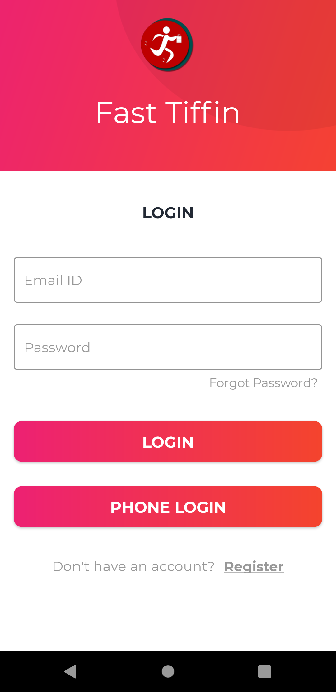
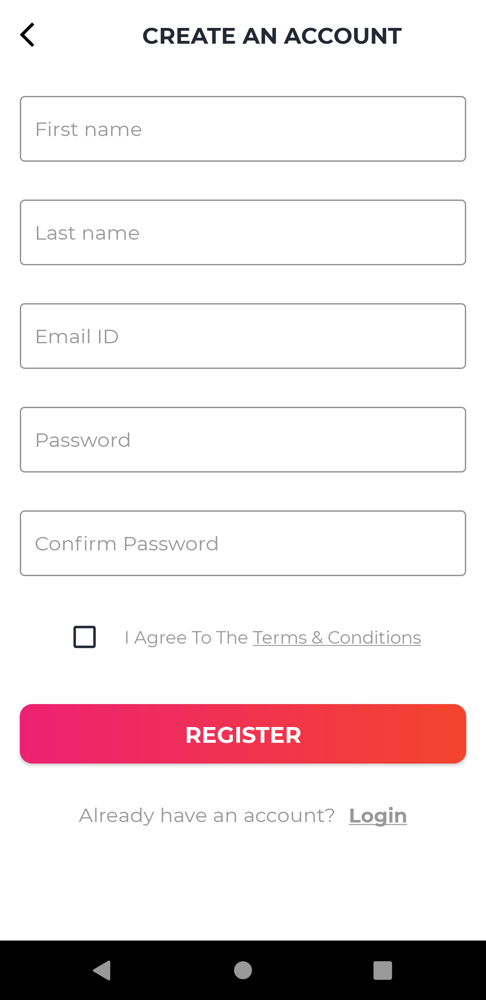

# Fast_Tiffin (A Food Delivery App)
A full fledged food delivery app with admin and user panel. 

## Languages Used
Kotlin   
Android  
XML  
Firebase  

## UI Design

     
    
     
    
     
    
     
    
    
    

